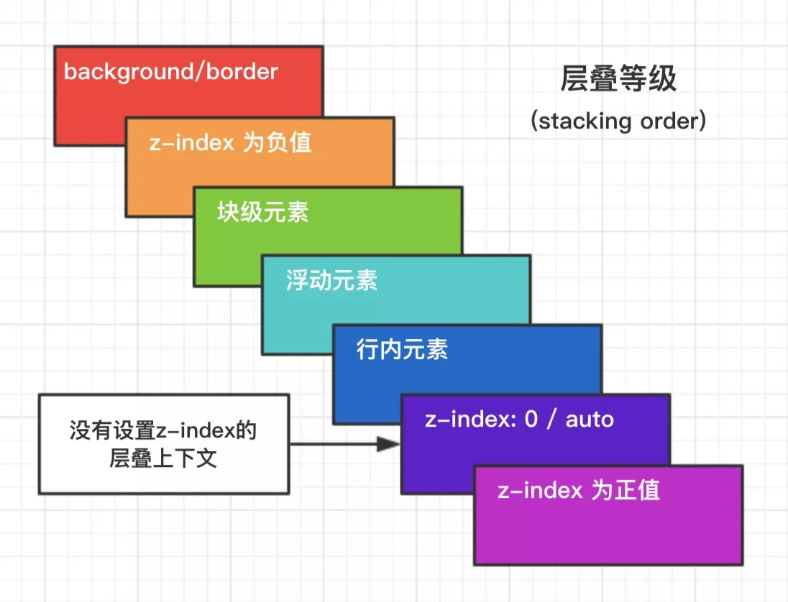

# 层叠上下文

涉及内容：
1. 层叠上下文作用
2. 触发条件
3. 具体顺序
4. 注意事项

## 层叠上下文作用
给元素更加丰富的图层方面的显示控制。

## 触发条件
- 根层叠上下文；
- 定位元素且z-index不是auto；
- 父元素的display属性值为`flex|inline-flex`，子元素`z-index`属性值不为`auto`的时候，子元素为层叠上下文元素；
- 元素的`opacity`属性值不是1
- 元素的`transform`属性值不是`none`；
- 元素`mix-blend-mode`属性值不是`normal`；
- 元素的`filter`属性值不是`none`；
- 元素的`isolation`属性值是`isolate`；

## 层叠上下文顺序

## 注意事项
- 层叠上下文所依据的根本，是最近拥有层叠上下文的元素。一般来说，依据的是html。是以根元素为分层画布，形成的不同层次的内容。
- 如果该元素不为层叠上下文元素，则background属于块级元素。